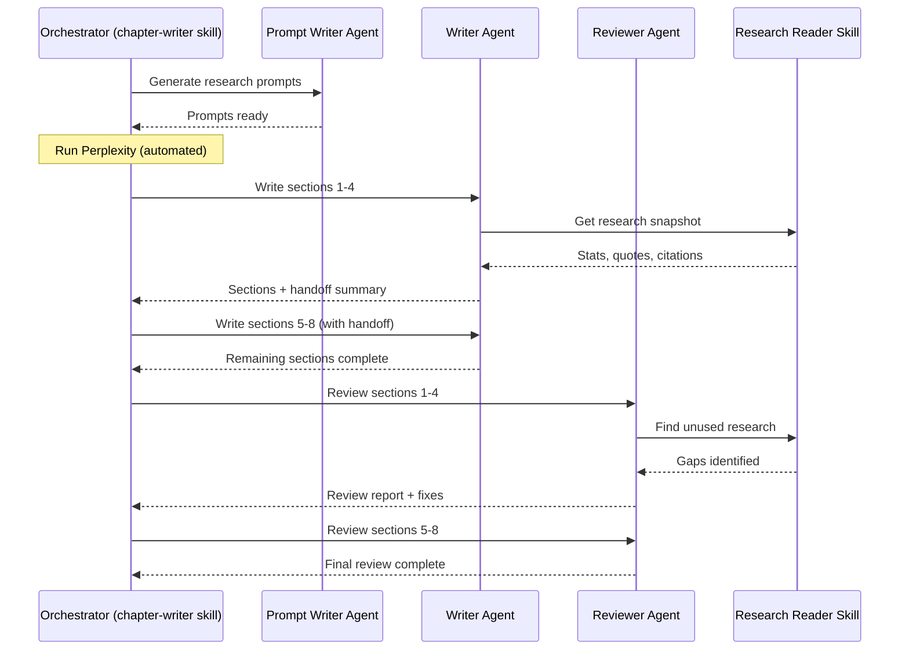

# Agent Architecture

> **Context:** The writing system for *Blueprint for An AI-First Company* uses 3 agents orchestrated by a chapter-writer skill. This document explains why separate agents exist, how they interact, and how to prevent quality degradation at scale.

---

Here's what most people get wrong about using AI for long-form writing: they treat it like one conversation. One agent, one system prompt, "write me a chapter." The output is fine for a blog post. It falls apart at book scale.

The fix isn't more prompting. It's separation of concerns -- different agents optimized for different jobs.

## Three Agents, Three Roles

| Agent | Model | Role | Success Metric |
|-------|-------|------|----------------|
| `saurav-writer-persona` | Claude Opus 4.5 | Write content in the author's voice | Voice match, research integration, density |
| `saurav-reviewer-persona` | Claude Opus 4.5 | Review for quality, voice, gaps | Issues found, research coverage, citation completeness |
| `perplexity-prompt-writer` | Claude Sonnet 4.5 | Generate research prompts | Prompt focus, coverage, no redundancy |

The writer creates. The reviewer critiques. The prompt writer researches. Each has its own system prompt, its own reference files, its own definition of done.

Why Opus for writing and reviewing but Sonnet for prompt generation? Prompt writing is a lighter cognitive task -- it needs focus and structure, not voice nuance or editorial judgment. Sonnet handles it well and runs faster. Writing and reviewing demand the full weight of Opus because they involve voice matching, argument construction, and pattern detection across sections.

## Why Separate Agents

Self-review by the same agent that wrote the content produces blind spots. I learned this the hard way in early drafts.

When a single agent writes a section and then reviews it, it doesn't catch its own patterns. It won't flag that 5 of 7 sections start with "Here's the thing." It won't notice the same company example appearing in three sections. It won't see that a statistic in section 3 contradicts one in section 7. These are real problems from our Draft 1.

The writer agent optimizes for creation -- voice, flow, argument, research synthesis. Its system prompt loads voice guides, audience profiles, and writing prompts. It's told to sound like a specific human. It has no kill lists, no pattern detection, no deduplication logic.

The reviewer agent optimizes for critique -- consistency, gaps, accuracy, density. Its system prompt loads authenticity markers, learnings from past mistakes, and a review checklist. It runs `find_unused.py` to catch research the writer missed. It checks citation format. It flags AI-pattern phrases the writer might have slipped in despite the voice rules.

Different priorities. Different tools. Different system prompts. That separation is what makes both agents good at their jobs.

## Agent vs Skill

This distinction tripped me up early, so let me be direct about it.

**Agents are personas.** They have voice, perspective, priorities. The writer agent *is* Saurav for the purpose of that session -- it reads his voice guide, adopts his phrases, follows his structural patterns. The reviewer agent *is* an editor with specific quality criteria.

**Skills are procedures.** They have steps, tools, checklists, scripts. The `book-chapter-writer` skill is an 8-step orchestration that tells agents what to do and when. The `research-reader` skill provides 9 extraction scripts that agents call during their work.

Skills can invoke agents. Agents execute within skills. The chapter-writer *skill* orchestrates the writer and reviewer *agents*. The agents don't know about the orchestration -- they just do their jobs when called.

## Section Batching

Quality degrades when one agent processes too many sections in a single session. After section 4, we consistently saw voice drift, repeated examples, and forgotten research. The context window fills up, earlier instructions get compressed, and the output gets generic.

The rule: max 4 sections per agent instance.

| Sections in Chapter | Strategy |
|---------------------|----------|
| 1-4 | Single agent handles all |
| 5-8 | 2 agents (max 4 each) |
| 9+ | 3 agents (distribute evenly) |

This applies to both writing (Step 3) and reviewing (Step 4). Lighter tasks like diagram creation and prompt generation can use a single agent for all sections because the cognitive load per section is lower.

## Handoff Protocol

When splitting work across agents, Agent 1 provides a handoff summary before Agent 2 starts. This isn't optional -- without it, Agent 2 has no context about what came before.

The handoff covers four things:

1. **Sections completed** -- what was written, which examples and case studies were used
2. **Key themes established** -- the narrative threads that need to continue
3. **Narrative thread for continuation** -- where the last section ended and where the next should pick up
4. **Style notes** -- any patterns established (Yirifi blockquote format, specific analogies, etc.)

Agent 2 reads this handoff *before* starting its work. The transitions between agent batches still need human review -- they're the most likely place for continuity breaks -- but the handoff summary makes them manageable rather than catastrophic.

## How It Flows

Here's the interaction pattern for a typical chapter:

The orchestrator (the chapter-writer skill) manages the sequence. It decides when to call which agent, passes handoff summaries between instances, and collects outputs. The agents themselves are stateless between invocations -- they read their instructions, do their work, and report back.

Notice that the research reader skill serves *both* agents but for different purposes. The writer uses it to get citation-ready content before writing. The reviewer uses it to find unused research after writing. Same tool, different workflows.

## When This Architecture Breaks

Let's be honest about the failure modes.

**Handoff quality varies.** If Agent 1's handoff summary is thin, Agent 2 will repeat examples or miss narrative threads. The fix: be explicit in the skill instructions about what the handoff must contain. We iterated on the handoff template three times before it was reliable.

**Reviewer-writer disagreement.** Sometimes the reviewer flags something the writer got right. The reviewer doesn't have the same intuition for voice -- it has rules, not instinct. Human judgment resolves these. The reviewer's job is to surface issues, not to be infallible.

**Agent count overhead.** More agents means more orchestration, more prompts to maintain, more places for instructions to drift. Three agents is the sweet spot for book writing. We considered a dedicated "fact checker" agent and decided the reviewer could handle it. Keep the agent count as low as you can while maintaining separation of concerns.

---

**Deep dives:** [Chapter Writer Skill](chapter-writer-skill.md) | [Quality Skills](quality-skills.md) | [Building Custom Skills](building-custom-skills.md)
