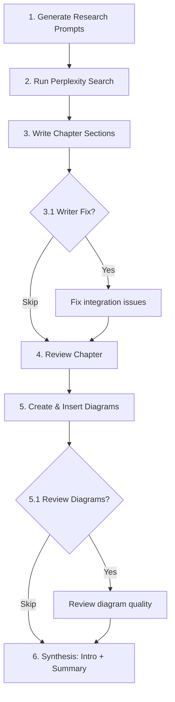

# The Chapter Writer Skill

> **Context:** The chapter-writer skill is the central orchestration that produces a complete chapter -- from research prompt generation through final synthesis. It coordinates 3 agents across 8 steps and handles batching, handoffs, and skip logic automatically.

---

Writing a book chapter with AI isn't a single prompt. It's an 8-step pipeline where each step feeds the next, different agents handle different phases, and smart skip logic prevents redundant work. This skill is the orchestrator that makes it all happen.

## The 8 Steps

| Step | Name | Agent | Optional |
|------|------|-------|----------|
| 1 | Generate Research Prompts | `perplexity-prompt-writer` | No |
| 2 | Run Perplexity Search | Script execution | No |
| 3 | Write Chapter | `saurav-writer-persona` | No |
| 3.1 | Writer Fix | `saurav-writer-persona` | Yes |
| 4 | Review Chapter | `saurav-reviewer-persona` | No |
| 5 | Create & Insert Diagrams | `saurav-writer-persona` | No |
| 5.1 | Review Diagrams | `saurav-reviewer-persona` | Yes |
| 6 | Synthesis (Intro + Summary) | `saurav-writer-persona` | No |

The flow moves from research to writing to review to visual to synthesis. Optional steps (3.1 and 5.1) exist for when content needs integration fixes or diagram quality checks, but they're skipped by default unless something needs attention.



## Pre-Flight Check

Before starting any chapter, the first thing the skill does is check what already exists. A `check_research_status.py` script scans the research directory and reports what's done and what's missing.

```bash
python .claude/skills/book-chapter-writer/scripts/check_research_status.py 7
```

The skip logic is straightforward:

| Prompts Status | Answers Status | Action |
|----------------|----------------|--------|
| Complete | Complete | Skip to Step 3 (Write) |
| Complete | Missing | Skip Step 1, Run Step 2 |
| Complete | Partial | Skip Step 1, Retry Step 2 with `--retry-failed` |
| Missing | Any | Start at Step 1 |

This prevents the most common waste: regenerating research that already exists. For a 12-chapter book, the cumulative time savings are substantial. Research generation takes 2-3 hours per chapter -- you don't want to redo it because you forgot what was already done.

## Step 3 Deep Dive: Writing

This is the core of the pipeline. For each section, the writer agent follows a specific sequence:

1. **Research snapshot** -- one script call (`research_snapshot.py`) returns ranked files, top stats, best quotes, and key companies for that section
2. **Citation formatting** -- `format_citations.py` extracts citation-ready content with footnote keys already formatted
3. **Argument support** -- `find_support.py` locates evidence for and against the section's arguments (the `--counter` flag matters for balanced writing)
4. **Write** -- the agent produces 1,200-1,300 words of prose content, synthesizing research into the author's voice
5. **Metadata** -- frontmatter updated, references section added, internal research block appended

The word count target is specific: 1,200-1,300 words of *prose content*, excluding frontmatter, references, and internal tracking blocks. This target was calibrated across 3 drafts. Under 1,000 words and sections feel thin. Over 1,500 and they lose density.

The batching rule from [Agent Architecture](agent-architecture.md) applies here. For a chapter with 7 sections, Agent 1 writes sections 1-4 with a handoff summary, then Agent 2 picks up sections 5-7. Each agent reads the full chapter intro before starting to understand structure and themes.

## Step 4 Deep Dive: Reviewing

The reviewer agent works differently than the writer. Where the writer starts with research and produces prose, the reviewer starts with the prose and works backward to find gaps.

For each section, the reviewer:

1. **Finds unused research** -- `find_unused.py` compares the draft against available research and surfaces stats, quotes, and companies that the writer missed
2. **Gets the full snapshot** -- `research_snapshot.py` provides the complete picture of what was available
3. **Checks high-value evidence** -- `extract_stats.py` and `extract_quotes.py` with `--min-credibility HIGH` flag surface only the strongest evidence
4. **Applies the review checklist** -- voice consistency, citation format, link integrity, example diversity, audience calibration
5. **Produces an assessment** -- each section gets rated: Pass, Needs Work, or Major Revision, with specific issues and suggested fixes

The reviewer also does something the writer can't: cross-section pattern detection. It flags when the same company example appears in multiple sections, when statistics conflict, or when opening patterns repeat. These are invisible within a single section but obvious when reviewing several in sequence.

The batching rule applies to reviewing too -- max 4 sections per reviewer agent instance, with handoff summaries noting issues found and patterns to watch for.

## Two Modes of Operation

**Step-by-step mode** (default): The skill pauses after each step, shows completion status, and asks whether to continue. This is the right mode when you're calibrating the system -- early chapters, new voice configurations, or when you want to inspect intermediate output before moving on. You can also select specific steps to run rather than running all 8.

**Auto mode**: The skill runs all required steps without pausing, only stopping at optional steps (3.1 and 5.1) to ask if they're needed. This is the right mode once you trust the pipeline -- typically after chapter 3 or 4, when you've verified that research prompts are producing useful output, the writer is hitting voice targets, and the reviewer is catching real issues.

The switch from step-by-step to auto is a signal that the system has matured. Don't rush it. The time you spend reviewing intermediate output in early chapters pays for itself in the later ones.

## Step 6: Synthesis

After all sections are written, reviewed, and have diagrams, the writer agent produces two bookend pieces.

**Chapter Intro** (`00-Chapter-Intro.md`): A 400-600 word opening that hooks the reader, previews each section with wiki-links, and frames the core argument. The hook must be concrete -- a story, a stat, or a specific company example. Not "In this chapter, we'll explore..." That's throat-clearing.

**Chapter Summary** (`99-Chapter-Summary.md`): A 500-700 word synthesis with 5-7 numbered takeaways, practical advice split by audience (startup vs. enterprise), and a bridge to the next chapter. The bridge matters -- it turns 12 standalone chapters into a continuous narrative.

Synthesis runs as a single agent pass regardless of chapter size because it needs the full chapter context to produce coherent bookends.

## What the Orchestration Actually Looks Like

A typical chapter run produces this output:

```
## Chapter 7 Writing Plan

**Chapter:** Agent Architecture Patterns
**Research:** Complete (skip Steps 1-2)
**Sections:** 7 (2 agent batches: 4 + 3)

| # | Step | Status | Agent |
|---|------|--------|-------|
| 1 | Generate Prompts | SKIP | -- |
| 2 | Run Perplexity | SKIP | -- |
| 3 | Write Chapter | Pending | saurav-writer-persona |
| 4 | Review Chapter | Pending | saurav-reviewer-persona |
| 5 | Create Diagrams | Pending | saurav-writer-persona |
| 6 | Synthesis | Pending | saurav-writer-persona |

Starting at: Step 3
```

The whole process for one chapter takes 3-5 hours of human time, with the bulk spent on editorial review after the automated pipeline completes. AI handles volume and consistency. The human handles judgment and taste.

---

**Deep dives:** [Agent Architecture](agent-architecture.md) | [Research Reader Skill](research-reader-skill.md) | [Research Architecture](../05-research-pipeline/research-architecture.md)
